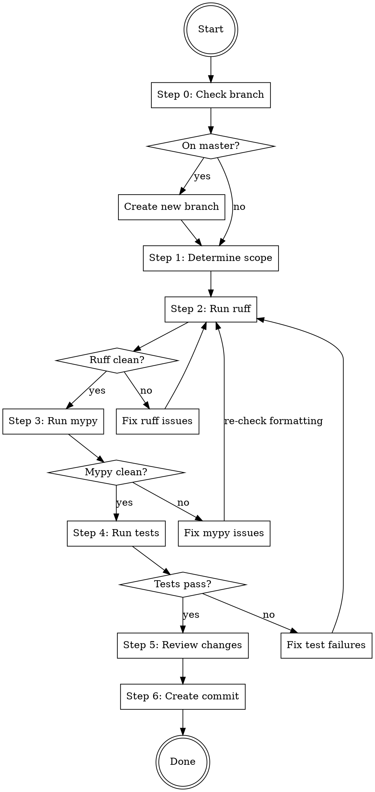

# Prepare Commit

## Overview

Full commit preparation workflow: verify code quality, review changes, and create a clean commit.

**Core principle:** Never commit with failing checks. Run all checks first, fix issues, then create a clean commit.

**Announce at start:** "Using prepare-commit skill to prepare and create a commit."

## When to Use

- Implementation is complete and you want to commit
- User says "prepare commit", "commit", "save changes", or similar

## The Process



### Step 0: Check Branch

**Never commit directly to master/main.** If on a protected branch, create a new one:

```bash
# Check current branch
git branch --show-current
```

**If on master or main:**
- Ask the user for a branch name, or derive one from the changes
- Create and switch to the new branch:
```bash
git checkout -b <branch-name>
```

### Step 1: Determine Scope

Identify changed files (staged and unstaged):

```bash
# List changed Python files (staged + unstaged)
git diff --name-only -- '*.py'
git diff --name-only --cached -- '*.py'

# Also check untracked Python files
git ls-files --others --exclude-standard -- '*.py'
```

Save the list of changed `.py` files — you'll run checks against these.

Also identify related test directories. For each changed source file, find corresponding test files.

### Step 2: Run Ruff (Lint + Format)

**Ruff check and ruff format are SEPARATE commands. Both must pass.**

```bash
# Fix lint issues automatically
uv run ruff check --fix <changed-files>

# Format
uv run ruff format <changed-files>

# Verify both pass cleanly
uv run ruff check <changed-files>
uv run ruff format --check <changed-files>
```

**If issues remain after auto-fix:** Fix manually, then re-run.

### Step 3: Run Mypy

```bash
# Type check changed files
uv run mypy <changed-files>
```

**If errors found:**
- Fix type errors in the changed files
- **Go back to Step 2 (ruff)** — mypy fixes can introduce new lint/format issues
- Re-run mypy to confirm clean

**Do NOT suppress errors with `# type: ignore` unless genuinely necessary.** Fix the actual type issue.

### Step 4: Run Tests

```bash
# Run tests for affected areas
uv run pytest <related-test-dirs> -v
```

**If tests fail:**
- Fix the failures
- Go back to Step 2 (ruff) since fixes may introduce new lint/type issues
- Full cycle: fix -> ruff -> mypy -> test

**If all pass:** Proceed to Step 5.

### Step 5: Review Changes

Analyze all staged and unstaged changes:

```bash
# Full diff (unstaged)
git diff

# Staged diff
git diff --cached

# Check for leftover debug code
git diff | grep -n "print(" || true
git diff | grep -n "breakpoint()" || true
git diff | grep -n "# TODO" || true
git diff | grep -n "import pdb" || true
git diff --cached | grep -n "print(" || true
git diff --cached | grep -n "breakpoint()" || true
git diff --cached | grep -n "# TODO" || true
git diff --cached | grep -n "import pdb" || true
```

**If debug code found:** Remove it, re-run checks from Step 2.

Prepare a mental summary:
- What changed and why (feature, bugfix, refactor)
- Key design decisions
- Files touched and their roles

### Step 6: Stage and Commit

```bash
# Check recent commit messages for style
git log --oneline -10

# Stage specific changed files (never use git add -A)
git add <specific-files>

# Verify what's staged
git diff --cached --stat

# Commit with descriptive message using HEREDOC
git commit -m "$(cat <<'EOF'
<commit message>

Co-Authored-By: Claude Opus 4.6 (1M context) <noreply@anthropic.com>
EOF
)"

# Verify commit succeeded
git status
```

**Commit message guidelines:**
- Under 70 chars for the subject line
- Imperative mood (e.g., "Add Concat indicator", "Fix null pointer in loader")
- Follow the repository's existing commit message style
- Summarize the "why" not just the "what"
- Do NOT commit files that likely contain secrets (.env, credentials, etc.)

**Show the commit hash and message when done.**

## Quick Reference

| Step | Command | Must Pass |
|------|---------|-----------|
| Branch check | `git branch --show-current` | Not on master/main |
| Ruff lint | `uv run ruff check --fix <files>` then `uv run ruff check <files>` | Yes |
| Ruff format | `uv run ruff format <files>` then `uv run ruff format --check <files>` | Yes |
| Mypy | `uv run mypy <files>` | Yes |
| Tests | `uv run pytest <test-dirs> -v` | Yes |
| Debug check | grep for print/breakpoint/pdb in diff | Clean |
| Stage | `git add <specific-files>` | - |
| Commit | `git commit -m "..."` | - |

## Common Mistakes

**Committing directly to master/main**
- Always check the current branch first. Create a new branch if on master/main.

**Running ruff check but forgetting ruff format**
- They are separate commands. Both must pass.

**Running mypy on the whole repo instead of changed files**
- Run on changed files only. Whole-repo issues aren't your problem.

**Skipping ruff re-check after mypy fixes**
- Mypy fixes can introduce new lint/format issues. Always re-run ruff after fixing type errors.

**Skipping re-check after test fixes**
- Every fix can introduce new issues. Always re-run the full check cycle.

**Using `git add -A` or `git add .`**
- Always stage specific files by name to avoid accidentally including secrets or unrelated changes.

**Committing with debug code left in**
- Always check diff for print/breakpoint/pdb before staging.

## Red Flags

**Never:**
- Commit directly to master/main
- Commit with failing ruff, mypy, or tests
- Suppress type errors with `# type: ignore` without justification
- Leave debug prints in the diff
- Skip the test step ("it's just a refactor")
- Use `git add -A` or `git add .`
- Commit files that may contain secrets

**Always:**
- Check the current branch before committing
- Run all checks on changed files
- Re-run ruff after any fix (mypy, test, or manual)
- Review the full diff before staging
- Stage specific files by name
- Follow the repository's commit message style
- Show the commit hash when done