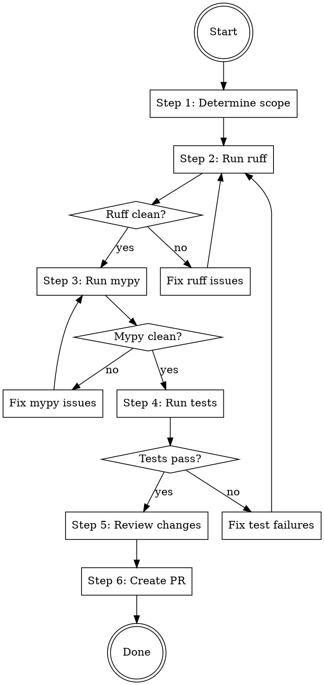

# Prepare PR

## Overview

Full PR preparation workflow: verify code quality, review changes, generate a thorough PR description, and create the PR.

**Core principle:** Never create a PR with failing checks. Run all checks first, fix issues, then create a clean PR.

**Announce at start:** "Using prepare-pr skill to prepare and create a Pull Request."

## When to Use

- Implementation is complete and you want to create a PR
- User says "prepare PR", "create PR", "open PR", or similar

## The Process



### Step 1: Determine Scope

Identify changed files and base branch:

```bash
# Find base branch
git merge-base HEAD main 2>/dev/null || git merge-base HEAD master 2>/dev/null

# List changed Python files relative to base
git diff --name-only <base-branch>...HEAD -- '*.py'

# Also check uncommitted changes
git diff --name-only -- '*.py'
git diff --name-only --cached -- '*.py'
```

Save the list of changed `.py` files — you'll run checks against these.

Also identify related test directories. For each changed source file, find corresponding test files.

### Step 2: Run Ruff (Lint + Format)

**Ruff check and ruff format are SEPARATE commands. Both must pass.**

```bash
# Fix lint issues automatically
uv run ruff check --fix <changed-files>

# Format
uv run ruff format <changed-files>

# Verify both pass cleanly
uv run ruff check <changed-files>
uv run ruff format --check <changed-files>
```

**If issues remain after auto-fix:** Fix manually, then re-run.

**If ruff modified files:** Stage the changes before proceeding:
```bash
git add <fixed-files>
git commit -m "Fix ruff lint/format issues"
```

### Step 3: Run Mypy

```bash
# Type check changed files
uv run mypy <changed-files>
```

**If errors found:**
- Fix type errors in the changed files
- Re-run ruff after fixes (Step 2)
- Re-run mypy to confirm clean

**Do NOT suppress errors with `# type: ignore` unless genuinely necessary.** Fix the actual type issue.

### Step 4: Run Tests

```bash
# Run tests for affected areas
uv run pytest <related-test-dirs> -v
```

**If tests fail:**
- Fix the failures
- Go back to Step 2 (ruff) since fixes may introduce new lint/type issues
- Full cycle: fix -> ruff -> mypy -> test

**If all pass:** Proceed to Step 5.

### Step 5: Review Changes

Analyze ALL commits on the branch (not just the latest):

```bash
# Full diff against base
git diff <base-branch>...HEAD

# Commit log
git log --oneline <base-branch>..HEAD

# Check for leftover debug code
git diff <base-branch>...HEAD | grep -n "print(" || true
git diff <base-branch>...HEAD | grep -n "breakpoint()" || true
git diff <base-branch>...HEAD | grep -n "# TODO" || true
git diff <base-branch>...HEAD | grep -n "import pdb" || true
```

**If debug code found:** Remove it, commit, re-run checks from Step 2.

Prepare a mental summary:
- What changed and why (feature, bugfix, refactor)
- Key design decisions
- Files touched and their roles

### Step 6: Push and Create PR

```bash
# Check if branch is pushed
git status -sb

# Push branch
git push -u origin <branch-name>

# Create PR with detailed description
gh pr create --title "<short-title>" --body "$(cat <<'EOF'
## Summary
<2-4 bullet points describing what changed and why>

## Changes
<List of key changes organized by area>

## Test plan
- [ ] <verification steps>

🤖 Generated with [Claude Code](https://claude.com/claude-code)
EOF
)"
```

**PR title:** Under 70 chars, imperative mood (e.g., "Add Concat indicator for multi-source data").

**PR body guidelines:**
- Summary: High-level what and why (not a commit-by-commit list)
- Changes: Group by logical area, not by file
- Test plan: Concrete verification steps

**Return the PR URL when done.**

## Quick Reference

| Step | Command | Must Pass |
|------|---------|-----------|
| Ruff lint | `uv run ruff check --fix <files>` then `uv run ruff check <files>` | Yes |
| Ruff format | `uv run ruff format <files>` then `uv run ruff format --check <files>` | Yes |
| Mypy | `uv run mypy <files>` | Yes |
| Tests | `uv run pytest <test-dirs> -v` | Yes |
| Debug check | grep for print/breakpoint/pdb in diff | Clean |
| Push | `git push -u origin <branch>` | - |
| Create PR | `gh pr create --title "..." --body "..."` | - |

## Common Mistakes

**Running ruff check but forgetting ruff format**
- They are separate commands. Both must pass.

**Running mypy on the whole repo instead of changed files**
- Run on changed files only. Whole-repo issues aren't your problem.

**Skipping re-check after fixes**
- Every fix can introduce new issues. Always re-run the full check cycle.

**Writing PR description from commit messages**
- Commits are implementation history. PR description should explain the change as a whole.

**Creating PR with uncommitted lint fixes**
- Stage and commit lint/format fixes before creating the PR.

## Red Flags

**Never:**
- Create a PR with failing ruff, mypy, or tests
- Suppress type errors with `# type: ignore` without justification
- Leave debug prints in the diff
- Skip the test step ("it's just a refactor")

**Always:**
- Run all checks on changed files
- Commit any auto-fix changes before creating PR
- Review the full branch diff, not just last commit
- Return the PR URL to the user